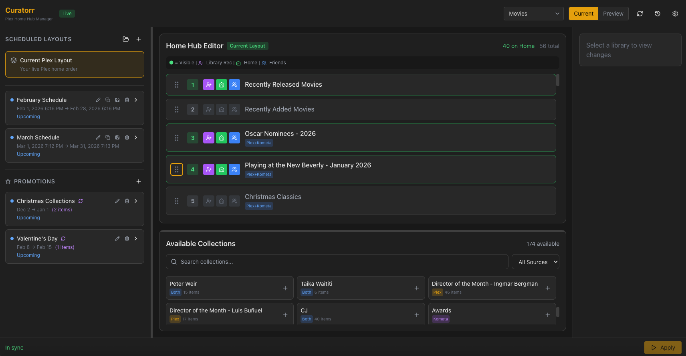
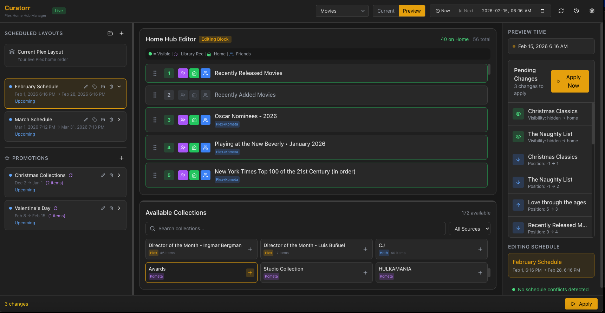
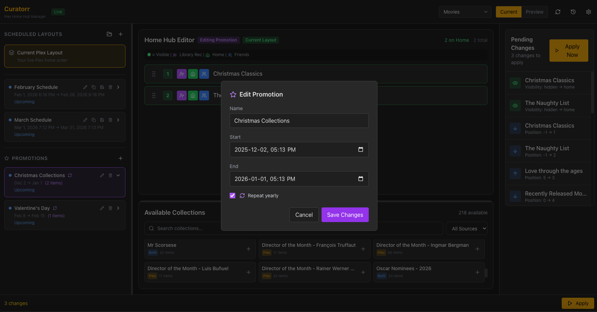
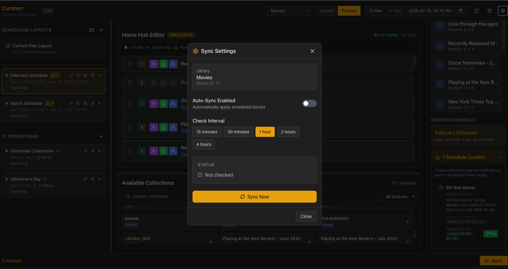
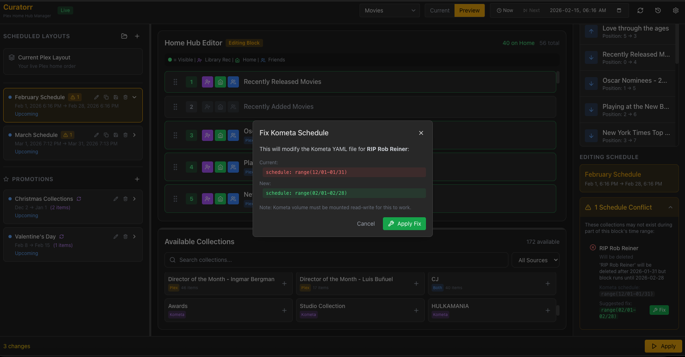

# Curatorr User Guide

## What Does This App Do?

Curatorr lets you control the order and visibility of collection rows on your Plex home screen - the same rows you see when you open Plex and scroll down past "Continue Watching."

In Plex, these are called **Managed Recommendations** (or "Promoted Hubs"). You can manually drag them around in Plex settings, but there's no way to schedule different layouts for different times.

That's what Curatorr does: schedule your home screen layout to change automatically.

**Example uses:**
- Feature horror collections during October, then switch to holiday movies in December
- Promote "New Releases" on weekends when you have time to watch
- Rotate featured directors or actors throughout the month

## Key Concepts

### Scheduled Layouts
A complete replacement of your Plex home order for a specific date range. When a scheduled layout is active, it completely controls what appears on your home screen.

### Promotions
A lightweight overlay that boosts specific collections to the top without changing the rest of your layout. Great for temporary highlights like "Christmas Classics" without rebuilding your entire layout.

### Priority Stack
When multiple things are scheduled, here's what takes priority:
```
PROMOTIONS (top)      - Always applied first if active
SCHEDULED LAYOUT      - Replaces your normal layout if active
CURRENT PLEX STATE    - Your baseline when nothing is scheduled
```

## Getting Started

### 1. First Launch

When you open Curatorr, you'll see your current Plex layout loaded automatically. The left panel shows your schedules and promotions, the center shows your collection order, and the right panel shows pending changes.



### 2. Understanding "Current Plex Layout"

The **Current Plex Layout** item in the left panel represents your normal Plex home screen - what shows when no schedule is active. Click it to see and edit your current live layout (which you can also do in plex).

### 3. Creating a Scheduled Layout

Click the **+** button next to "SCHEDULED LAYOUTS" to create a new one:

1. Give it a name (e.g., "Halloween Season")
2. Set the start and end dates/times
3. Enable **Repeat yearly** if it should happen every year
4. Click Create

The new schedule starts  with the same layout of whatever scheduled layout precedes it chronologically - you can then re-order, change visibility, or drag collections from the bottom panel to build your layout.



### 4. Creating a Promotion

Click the **+** button next to "PROMOTIONS" to create one:

1. Give it a name (e.g., "Oscar Season")
2. Set the date range
3. Enable **Repeat yearly** for annual events
4. Click Create

Add the specific collections you want boosted to the top. These will overlay on whatever layout is currently active.



### 5. Customizing Your Layout

With a schedule or promotion selected:

- **Drag collections** from "Available Collections" at the bottom into your layout
- **Drag rows** up or down to reorder
- **Toggle visibility** using the checkboxes:
  - 👤 Library Recommended
  - 🏠 Home (your account)
  - 👥 Friends (shared users)

### 6. Applying Changes

Click **Apply** to push your layout to Plex.

- In **dry-run** mode (yellow badge): Nothing changes, just previews what would happen
- In **live** mode (green badge): Your Plex home screen updates immediately



## Preview Mode

Click **Preview** in the top bar to time-travel:

- See what your home screen will look like at any date/time
- Use **Now** to jump to current time
- Use **Next** to jump to the next schedule boundary
- The editor shows exactly which layout and promotions would be active

This is great for verifying your schedules before they go live.

## Saved Layouts

Save any layout as a reusable template:

1. Build a layout you like
2. Click the **Save** icon (floppy disk) in the header
3. Give it a name and optional description
4. Later, click the **Load** icon (folder) to apply it to a new schedule

## Status Indicators

| Indicator | Meaning |
|-----------|---------|
| 🟢 Green dot + "Active now" | Currently live on Plex |
| 🔵 Blue dot + "Upcoming" | Will activate at scheduled time |
| ⚫ Gray dot + "Ended" | Schedule has passed |
| 🔄 Repeat icon | Repeats every year |

## Kometa Integration

Curatorr works alongside Kometa. If you use Kometa, mount your config folder to populate collection pool with kometa collections and enable schedule conflict detection. If you use Kometa to create collections with scheduled date ranges, Curatorr can detect potential conflicts.

Curatorr reads your Kometa YAML files and warns you when a collection's schedule conflicts with your layout block. Mount with `:rw` instead of `:ro` to enable one-click conflict auto-fix




### Schedule Conflict Detection

When you select a layout block, Curatorr checks if any collections in that block have Kometa schedules that don't cover the full block duration. For example:

- Your block runs Feb 1-28
- A collection's Kometa schedule is `range(12/01-01/31)`
- Curatorr warns: "This collection will be deleted after Jan 31 but your block runs until Feb 28"

A yellow warning badge on the block indicates conflicts. Click the block to see details in the right panel.

### Auto-Sync Kometa Schedules

When a conflict is detected, Curatorr suggests a new schedule and offers to sync it automatically:

1. Click the green **Fix** button next to the suggested schedule
2. Review the before/after in the confirmation modal
3. Click **Apply Fix** to update the Kometa YAML file

The fix uses surgical string replacement - only the `schedule:` line changes, preserving all your comments and formatting.


### Configuring Kometa Access

To enable auto-sync, mount your Kometa config directory as **read-write**:

```yaml
# docker-compose.yaml
services:
  curatorr:
    volumes:
      - /path/to/kometa/config:/kometa:rw  # Read-write for auto-fix
```

For read-only access (conflict detection only, no fixing):

```yaml
      - /path/to/kometa/config:/kometa:ro  # Read-only
```

If mounted read-only, the Fix button will show an error explaining the volume isn't writable.

### Current Limitations

The auto-fix only updates the `schedule:` line in Kometa collection files. If your collections also have `visible_home`, `visible_shared`, or `visible_library` date ranges, you'll need to update those manually in the YAML files.

## Tips

**Start with dry-run mode** until you're comfortable. You can see exactly what would change without affecting your Plex server.

**Use promotions for temporary boosts.** If you just want to feature a few collections for a week, a promotion is simpler than creating a whole new layout.

**Enable repeat yearly** for holidays. Set up your Halloween and Christmas layouts once, and they'll activate automatically every year.

**The app must be running** for scheduled changes to apply. If Curatorr is stopped when a schedule starts, the layout won't update until you restart it.

## Troubleshooting


**Changes not applying?**
Check that you're in `apply` mode, not `dry-run`. Look at the mode indicator (green "Live" vs yellow "Dry-run") in the header.

**Schedule didn't activate?**
Verify Curatorr was running at the scheduled time and that you set 'auto-sync' in settings. Check the container logs for any errors.

**Promotion not showing?**
Promotions only work when their date range is active. Use Preview mode to verify the dates are correct.
